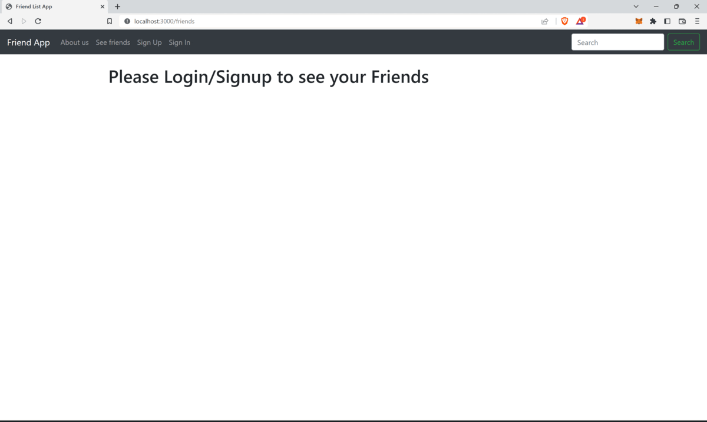

##### Prerequisites

The setups steps expect following tools installed on the system.

- Ruby [2.7.7](https://www.ruby-lang.org/en/news/2022/11/24/ruby-2-7-7-released/)
- Rails [7.0.4.2](https://rubygems.org/gems/rails/versions/7.0.4)

Gem used - Devise [get gem](https://rubygems.org/gems/devise)

##### 1. Check out the repository

```bash
git clone git@github.com:Kartik-Katkar/Rails-Friends-Application.git
```

##### 2. Create database.yml file

Copy the sample database.yml file and edit the database configuration as required.

```bash
cp config/database.yml.sample config/database.yml
```

##### 3. Create and setup the database

Run the following commands to create and setup the database.

```ruby
bundle exec rake db:create
bundle exec rake db:setup
```

##### 4. Start the Rails server

You can start the rails server using the command given below.

```ruby
bundle exec rails s
```

And now you can visit the site with the URL http://localhost:3000

Objective - Learning Ruby on Rails with a Project

## Screenshots of working

<p align="center">
  
</p>

